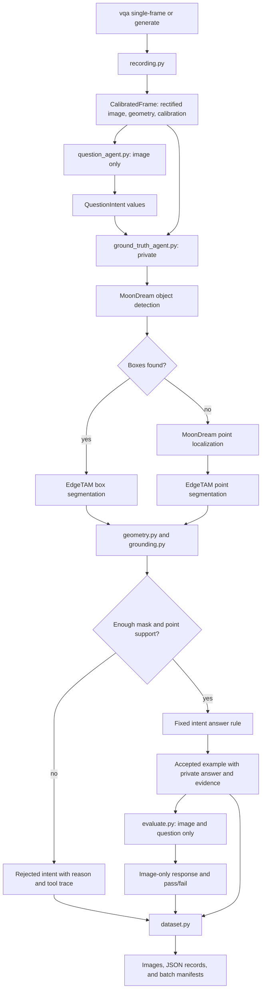

# Single-Frame VQA Architecture

This guide describes the code structure behind the [single-frame VQA pipeline](/docs/capabilities/perception/single-frame-vqa.md). It is intended for changing or debugging generation behavior, not for running the commands.

## Data Flow

One command selects independent recording frames. Each frame follows this private-data path:

1. `recording.py` loads and rectifies the RGB image, aligns the recording's geometry to that image, and creates a `CalibratedFrame`.
2. `question_agent.py` sees only the rectified image and proposes object queries. It expands each query into supported `QuestionIntent` values.
3. `ground_truth_agent.py` receives the full calibrated frame and one intent. It detects the requested object, segments it, projects visible geometry into the image, and derives grounded objects.
4. The same ground-truth agent applies the deterministic rule for the intent and returns either an answer with evidence or a rejection.
5. `evaluate.py` asks the evaluated visual model only for an answer to the image and accepted question. It has no point cloud, mask, tool trace, or expected answer.
6. `dataset.py` persists images, accepted examples, rejections, private evidence, and evaluation results.

The evaluation boundary is intentional: `ground_truth.json` must remain private when evaluating an image-only model.

## Source Layout

| File | Responsibility |
|---|---|
| `dimos/cli/vqa.py` | Typer commands. `single-frame` processes one Go2 recording frame; `generate` loops over sampled frames, skips completed frame directories, and rebuilds aggregate manifests. |
| `dimos/perception/vqa/models.py` | Typed contracts shared across the pipeline: calibrated frames, question intents, grounded objects, tool traces, results, and perception-model protocols. |
| `dimos/perception/vqa/recording.py` | Go2 recording adapter. Reads color image, LiDAR, and nearest odometry; rectifies the fisheye image and constructs the LiDAR-to-camera transform. |
| `dimos/perception/vqa/question_agent.py` | Image-only OpenAI question proposer. Validates returned object names or structured intents and expands object names into the supported question types. |
| `dimos/perception/vqa/ground_truth_agent.py` | Private deterministic executor. Calls detection, box segmentation or point-prompt fallback segmentation, grounds masks, caches per-object grounding, selects evidence, and accepts or rejects each intent. |
| `dimos/perception/vqa/adapters.py` | Bridges MoonDream and EdgeTAM APIs to the VQA detector, point-localizer, segmenter, and image-only answerer protocols. |
| `dimos/perception/vqa/geometry.py` | Static calibrated pinhole projection and z-buffer visibility filtering. It returns only the nearest point at each image pixel. |
| `dimos/perception/vqa/grounding.py` | Intersects projected visible points with each segmentation mask and computes the supported point count, median range, and left/center/right direction. |
| `dimos/perception/vqa/questions.py` | Deterministic construction of the original presence, direction, and threshold-distance examples from grounded objects. |
| `dimos/perception/vqa/evaluate.py` | Normalizes an image-only model's response and compares it with the private expected answer. |
| `dimos/perception/vqa/pipeline.py` | Small reusable helpers for conventional ground-truth generation and image-only evaluation. |
| `dimos/perception/vqa/dataset.py` | Writes per-frame artifacts and rebuilds `frames.jsonl`, `ground_truth.jsonl`, and `manifest.json` for a batch dataset. |
| `dimos/perception/vqa/test_agents.py` | Unit tests for proposal, tool traces, fallback grounding, comparison, and rejection behavior. |
| `dimos/perception/vqa/test_geometry.py` | Unit tests for calibrated projection and z-buffer behavior. |
| `dimos/perception/vqa/test_single_frame.py` | End-to-end synthetic-frame generation and image-only evaluation test. |

## Ground-Truth Execution

The implementation does not let an LLM invent a perception procedure. The question type selects a fixed plan, while the object name and threshold are inputs to that plan.

| Intent | Input values | Deterministic answer rule |
|---|---|---|
| `presence` | Object query | Accept only if at least one object has a valid mask and sufficient foreground geometry. Answer `yes`; otherwise reject. |
| `horizontal_direction` | Object query | Select the nearest grounded object and return its `left`, `center`, or `right` image region. |
| `within_distance` | Object query and distance threshold | Select the nearest grounded object and compare its median range to the threshold. |
| `compare_nearest_by_side` | Object query | Select the nearest grounded object on the left and on the right, then return the closer side. Reject if either side lacks evidence or the ranges are equal. |

For every intent, grounding first tries MoonDream box detection followed by EdgeTAM box segmentation. If detection returns no boxes, it can fall back to MoonDream positive-point localization followed by EdgeTAM point-prompt segmentation. Small masks or masks with too few projected foreground points do not establish a negative answer; they cause rejection.

## Frame And Dataset Records

`single-frame` writes the record directly. `generate` uses `write_frame_record()` for each frame and then uses `write_dataset_manifest()` to aggregate all completed frames.

| Artifact | Contains | Privacy |
|---|---|---|
| `image.jpg` | Rectified image used by all visual-model calls | May be provided to the evaluated visual model. |
| `original_image.jpg` | Raw recording image, if available | Audit artifact only. |
| `grounding_overlay.jpg` | Private masks, MoonDream detector boxes or point prompts, `Q` labels, and an answer/rejection legend | Private audit artifact. |
| `intents.json` | Proposed or explicit constrained intents | Generation metadata. |
| `examples.json` | Accepted question and expected-answer records | Keep expected answers private during evaluation. |
| `ground_truth.json` | Answered and rejected results, grounded-object evidence, and tool traces | Private ground truth. |
| `evaluations.json` | Image-only model responses and pass/fail comparison | Evaluation result. |
| `frame.json` | Frame identity, source, artifact names, counts, models, and grounding thresholds | Dataset metadata. |
| `frames.jsonl` | One `frame.json` record per completed batch frame | Batch metadata. |
| `ground_truth.jsonl` | One private result record per intent across the batch | Private aggregate ground truth. |
| `manifest.json` | Counts of frames, accepted questions, and rejections | Batch summary. |

## Extension Points

To add a recording source, create an adapter that returns `CalibratedFrame` with a rectified image, matching camera intrinsics, and a point cloud or depth-derived point cloud in the camera frame. Then expose it through the CLI without changing the question, grounding, or evaluation privacy boundary.

To add a question type, extend `QuestionKind`, validate it in `question_agent.py`, add its deterministic answer rule in `ground_truth_agent.py`, expose it in explicit CLI query expansion, and add accepted and rejected test cases. The tool trace and grounded evidence should remain sufficient to independently audit the answer.
